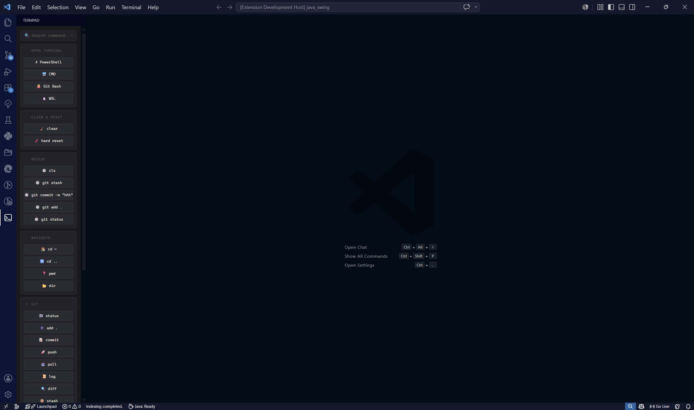
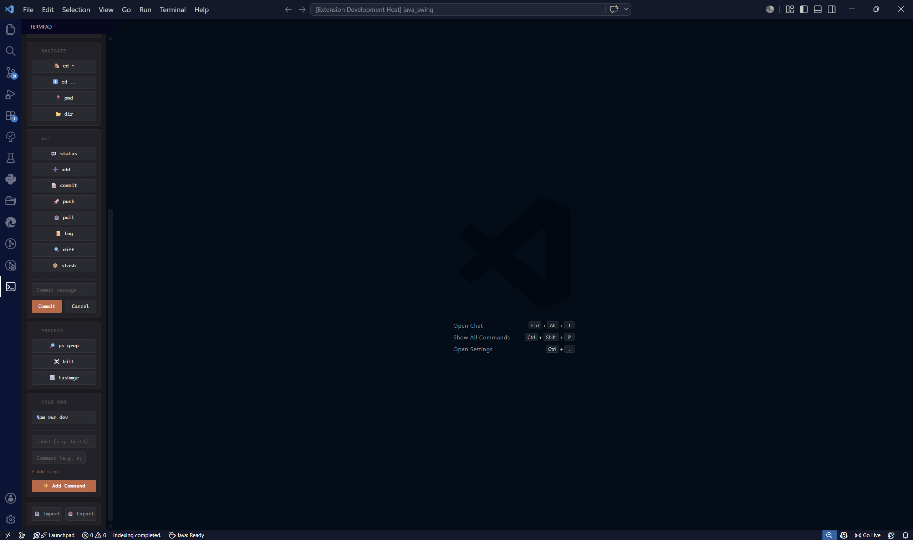

<div align="center">

<pre style="display: inline-block; text-align: left; font-weight: bold; background: none; border: none; padding: 0;">
  ________________  __  _______  ___    ____
 /_  __/ ____/ __ \/  |/  / __ \/   |  / __ \
  / / / __/ / /_/ / /|_/ / /_/ / /| | / / / /
 / / / /___/ _, _/ /  / / ____/ ___ |/ /_/ /
/_/ /_____/_/ |_/_/  /_/_/   /_/  |_/_____/
</pre>

<br>

**Your terminal. One click away.**

[](https://marketplace.visualstudio.com/items?itemName=kaustubhbhoir.termpad)
[](https://antigravity-ide.com)
[](LICENSE)
[](CONTRIBUTING.md)

*Works in VS Code · Cursor · Google Antigravity · any VS Code fork*

</div>

---

## 🚀 Installation

You can install **TermPad** directly within your editor or via the web:

### In VS Code or Cursor:
1. Open the **Extensions** panel (`Ctrl + Shift + X` or `Cmd + Shift + X`).
2. Search for **`TermPad`** (by `kaustubhbhoir`).
3. Click **Install**.

### From the Web:
Visit the [VS Code Marketplace](https://marketplace.visualstudio.com/items?itemName=kaustubhbhoir.termpad) and click **Install**.

---

## What is TermPad?

You open a project. You type `git status`. Then `npm run dev`. Then `cd ..`. Then `clear`. Then `git status` again.

TermPad puts all of that in a sidebar dashboard. **Click button → command runs.** No terminal focus-switching, no retyping, no wasted keystrokes.

---

## Screenshots

<div align="center">

&nbsp;&nbsp;&nbsp;&nbsp;

</div>

---

## Features

**⚡ One-click terminal commands**  
Every button fires a command into your active terminal instantly. If no terminal is open, TermPad opens one for you.

**🐚 Multi-shell launcher**  
Fresh terminal in your preferred shell, one click. TermPad auto-detects what's available on your OS:

| OS | Available Shells |
|---|---|
| Windows | PowerShell, CMD, Git Bash, WSL |
| macOS | zsh, bash, fish |
| Linux | bash, zsh, fish, sh |

**🔍 Instant search**  
Type in the search bar. All sections and buttons filter live. Useful once your custom commands list grows.

**🔄 Drag-and-drop layout**  
Hover any section header → drag → done. Order is saved automatically.

**➕ Custom command buttons**  
Add `npm run dev`, `docker compose up`, `python manage.py runserver` — whatever you repeat every day — with a label and one click. Remove them just as easily.

**💾 Import / Export**  
Export your entire dashboard config to JSON. Import it on any machine or share it with your team.

---

## Getting Started

**1. Open TermPad**  
Find the TermPad icon in the VS Code Activity Bar (works the same in Cursor and Google Antigravity's Editor View). Click it.

**2. Run a command**  
Click any button. Done.

**3. Add your own commands**  
Go to *Your Own* → enter a label + command → click **+ Add Command**.

**4. Back up your setup**  
Click **Export** at the bottom to save a `.json` snapshot. **Import** to restore it anywhere.

---

## Works In

| Editor | Status |
|---|---|
| VS Code | ✅ Full support |
| Cursor | ✅ Full support |
| Google Antigravity | ✅ Compatible (Editor View) |
| Any VS Code fork | ✅ Should work |

> **Antigravity users:** TermPad slots right into Antigravity's Editor View sidebar. Great pairing — let your agents handle the complex tasks in Manager View while TermPad keeps your frequent manual commands one click away.

---

## Local Development

```bash
git clone <repo-url>
cd termpad
npm install
# Hit F5 in VS Code to open a Development Host with TermPad active
```

Source is under `src/` and `media/`.

---

## Contributing

PRs are welcome. Open an issue first if it's a bigger change so we're aligned before you build it.

---

## Author

**Kaustubh Bhoir** — Computer Engineering  
[](https://www.linkedin.com/in/kaustubh-bhoir-ce/)

---

## License

MIT — use it, fork it, ship it.
